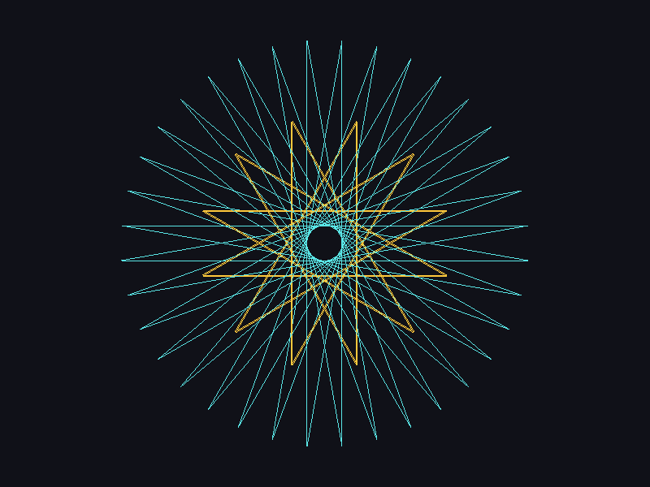
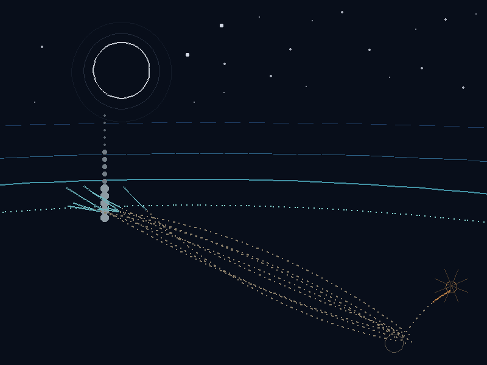

# Fluxa Turtle

A visual programming tool written in Fluxa-lang. You write a sequence of
actions, save the file, and the screen responds — without restarting anything.
The turtles, the drawings, the positions and the steps already finished stay
alive, because the state survives the hot reload.

**Write, save, and watch the next action happen.**



---

## Installing

Fluxa Turtle is written in Fluxa-lang, and the runtime is not shipped in this
repository. Build it once from the language repo:

**[github.com/RodBarenco/fluxa-lang](https://github.com/RodBarenco/fluxa-lang)**

You need **Linux and an OpenGL 3.3 context**. A GPU driver is the usual way to
have one, but it is not required: Mesa's software renderer draws this the same,
just slower — measured here, `LIBGL_ALWAYS_SOFTWARE=1` produces a
**pixel-identical** image and takes a 3000-segment rebuild from 173 ms to
213 ms. Three steps: the system libraries, Raylib, then the runtime itself.

### 1. System libraries

`make build` builds the whole standard library, so it wants the development
packages of everything it can link. On Debian, Ubuntu or Pop!_OS:

```bash
sudo apt update
sudo apt install -y build-essential make python3 git pkg-config \
    libsodium-dev libcurl4-openssl-dev libffi-dev zlib1g-dev \
    libsqlite3-dev libpq-dev libmicrohttpd-dev libmosquitto-dev
```

What each one is there for: **libsodium** (crypto), **libcurl** (`std.http`
client), **libffi** (the FFI), **zlib** (compression), **libsqlite3** and
**libpq** (the databases), **libmicrohttpd** (the HTTP server), **libmosquitto**
(MQTT). Turtle itself uses none of them — they are the cost of building the full
runtime. Fedora: the same names with `-devel`. Arch: `libsodium curl libffi zlib
sqlite postgresql-libs libmicrohttpd mosquitto`.

### 2. Raylib

This is the one Turtle actually needs, and the one no distribution ships in a
current enough version — build it from source:

```bash
sudo apt install -y libgl1-mesa-dev libx11-dev libxrandr-dev \
    libxinerama-dev libxcursor-dev libxi-dev

git clone --depth 1 https://github.com/raysan5/raylib
cd raylib/src
make PLATFORM=PLATFORM_DESKTOP
sudo make install
sudo ldconfig
```

It installs into `/usr/local/lib`. This project is developed against **raylib
6.0** (`libraylib.so.600`).

### 3. The runtime

```bash
git clone https://github.com/RodBarenco/fluxa-lang
cd fluxa-lang
make build FLUXA_GRAPH_RAYLIB=1 FLUXA_IMAGE_RAYLIB=1
```

The two flags are what Turtle needs: the window, the strokes and the baked
texture come from `std.graph`, and the canvas, the capture and the PNGs from
`std.image` — both on Raylib. The language README is the authority on the build
flags if they change.

The binary lands in the repository root. Put it in this project's root, or
anywhere on your `PATH`:

```bash
cp fluxa /path/to/fluxa-turtle/
```

### Is it actually drawing?

`std.graph` has two backends, and the one you get is decided at build time. If
Raylib was not found, the build **falls back to a stub** — an API-complete
backend that draws nothing. Nothing crashes: the window "opens", every call
succeeds, `graph.capture` returns a blank buffer, and an export comes out empty.
That is the one failure worth being able to name, so ask the binary directly:

```fluxa
import std graph
print(graph.version())
```

| What it prints | What you have |
|---|---|
| `raylib/6.0` | the real backend — it draws |
| `fluxa-graph/1.0 (stub — no display)` | the stub — rebuild the runtime with `FLUXA_GRAPH_RAYLIB=1` |

Three messages tell you the same thing earlier, and they are worth recognising:

- at build time — `std.graph: FLUXA_GRAPH_RAYLIB=1 requested but raylib not
  found — using stub`. The flag was passed and Raylib was not there.
- at run time, on stderr — `[fluxa] std.graph: stub backend — window ... created`.
  You are running the stub.
- at run time, from `graph.init` — `no usable OpenGL driver`. Raylib is in, but
  there is no GL context. Try `LIBGL_ALWAYS_SOFTWARE=1 ./fluxa run main.flx -dev`,
  which is Mesa drawing on the CPU.

`ldd ./fluxa | grep raylib` answers the same question from outside, and `ffmpeg`
is worth having, but only to turn an export into a format `std.video` does not
write.

The libs this project uses are already declared in `fluxa.toml`: `std.graph`,
`std.image`, `std.math`, `std.time`, `std.strings`, `std.fs` and `std.video`.

### 4. Syntax highlighting

`.flx` files come out grey in an editor that has never heard of Fluxa. The
highlighter lives in **[github.com/RodBarenco/fluxa-tooling](https://github.com/RodBarenco/fluxa-tooling)**:

```bash
git clone https://github.com/RodBarenco/fluxa-tooling
cd fluxa-tooling
```

**VS Code** — it is not on the Marketplace, so install the `.vsix` by hand:

```bash
code --install-extension highlighter/vs-code/fluxa-lang-0.1.0.vsix
```

**Neovim** — copy the two files:

```bash
mkdir -p ~/.config/nvim/ftdetect ~/.config/nvim/syntax
cp highlighter/neovim/ftdetect/fluxa.vim ~/.config/nvim/ftdetect/
cp highlighter/neovim/syntax/fluxa.vim   ~/.config/nvim/syntax/
```

Or through a plugin manager — vim-plug:

```vim
Plug 'RodBarenco/fluxa-tooling'
```

lazy.nvim:

```lua
{
    "RodBarenco/fluxa-tooling",
    ft = "fluxa",
    config = function()
        vim.opt.rtp:append(vim.fn.stdpath("data") .. "/lazy/fluxa-tooling/highlighter/neovim")
    end
}
```

An LSP (go-to-definition, hover, diagnostics, completion) is announced there as
coming.

### Windows

**Turtle does not work on Windows yet: the hot reload does not run there.** The
language itself builds on Windows (MSYS2 — see `docs/WINDOWS.md` in the language
repository), but `-dev` — watch the file, reload on save, keep the window and
the finished steps alive — is what this whole tool is, and it is not available
in that build. Linux is the supported platform; macOS builds the language but is
untested here.

---

## Running it

```bash
./fluxa run main.flx -dev
```

`-dev` is the mode that matters: it watches the file and reloads on every save,
preserving what already happened. The window does not blink, the drawing does
not disappear, and only the new steps are animated.

Without `-dev` the program runs once and leaves the artwork on screen until you
close the window.

---

## The core idea: the step

Every action carries a **step** number. That number is the composition's
logical stage, and it is what organises everything:

```fluxa
leo.go(1, 200.0, 0.0)     // step 1: walk 200 px, no turn
leo.go(2, 200.0, 144.0)   // step 2: turn 144 degrees and walk 200 px
```

Three rules follow from it:

**Finished steps do not repeat.** When you save again, what already happened is
rebuilt instantly and execution carries on from the next step not yet
performed. That is what lets you build the artwork bit by bit — and a save that
lands in the *middle* of a movement is not lost either: that step carries on
from where it was ([adr 0014](docs/adr/0014-a-movement-survives-the-save.md)).

**The same step means simultaneous.** Different turtles with actions on the
same step move at the same time. The step only ends when the last of them
arrives.

```fluxa
leo.go(1, 200.0, 0.0)     // both set off together
ana.go(1, 220.0, 0.0)     // and step 1 lasts as long as the slower one
```

**One action per turtle per step.** If the same turtle gets two actions on the
same step, the first one counts and the second is ignored — a turtle cannot
make two movements at once. Execution is not interrupted by it.

---

## Getting started

`main.flx` already comes with an artwork, almost entirely commented out on
purpose. Uncomment **one stage**, save, and see what shows up. Then the next.

| Stage | What it shows |
|---|---|
| 1 | one turtle, one stroke |
| 2 | thirty-five more steps turn it into the rosette |
| 3 | a second turtle drawing at the same time, entering without a trail |
| 4 | the stroke changing from the step where you change it |
| 5 | an image as the background |
| 6 | one line that writes the artwork as an MP4 |

The image at the top of this page is what those stages produce — captured from
the window, not an illustration.

**[docs/artworks/one-night.md](docs/artworks/one-night.md)** is the piece to
read first: a sea turtle under a full moon, drawn as line art by four turtles at
once, and the broken light she steers by. It comes with the video, the story
behind it, and the whole thing ready to paste.

[](docs/artworks/one-night.md)

**[docs/ARTWORKS.md](docs/ARTWORKS.md)** has eight more compositions ready to
paste — rosettes, spirals, mandalas, a flower. Each one comes with the image
that this exact code produces.

**[docs/RECIPES.md](docs/RECIPES.md)** has the loose pieces: ready-made
turtles, closed shapes, palettes, rhythm tricks.

---

## The turtle

Each turtle is an independent instance:

```fluxa
Block leo typeof turtle.Turtle
leo.spawn(340.0, 363.0)
leo.path_color(0, 224, 150)
leo.path_width(3)
leo.hide()

leo.go(1, 200.0, 0.0)        // step 1: walk 200 px
leo.ring(2, 35, 200.0, 170.0) // steps 2 to 36: the same, turning 170° each time
```

Angles are in degrees: **0 points right** and the angle grows counter-clockwise.

Three kinds of call, and telling them apart explains most of what looks
surprising at first:

| Kind | When it happens | Examples |
|---|---|---|
| **declaration** | at once | `spawn`, `face` |
| **appearance** | from the next step this turtle declares | `color`, `path_width`, `speed`, `hide` |
| **step** | on the step number you give it | `go`, `toward`, `erase`, `pivot` |

So a colour written between step 36 and step 37 leaves the first thirty-six as
they are and paints what comes after. Move it above them and it affects them.

```fluxa
leo.toward(5, 400.0, 300.0)      // be at this point, rather than turn-and-walk
leo.erase(1, 8)                  // take those eight steps of hers back out
leo.pivot(300, 12.0, 467, 470)   // turn what she has drawn, without redrawing it
leo.image("turtle.png", 0.6)     // and she can be a picture, pointing where she walks
```

### The stroke is not just a line

```fluxa
leo.path_glow()        // neon: wide and faint, over narrow and solid
leo.path_marker()      // a felt marker: a halo with a core
leo.path_brush()       // the width breathes along the stroke
leo.path_spray()       // dots scattered around the line
leo.path_triangles()   // shapes repeated along it, pointing where she walks
```

Plus `path_squares`, `path_stars`, and the four that were always there —
`path_solid`, `path_dotted`, `path_dashed`, `path_dots`. They cost nothing per
frame, because the path is baked; a marker or a glow does make the rebuild
(once per save) about twice as slow, which the guide measures.

### Shapes you do not have to work out

A figure is a batch of steps, and these declare it for you — placed by its
**centre**, drawn in her colour, one side per step:

```fluxa
leo.circle(1, 400.0, 300.0, 120.0)
leo.polygon(1, 400.0, 300.0, 90.0, 12)          // any number of sides
leo.star(1, 400.0, 300.0, 80.0, 32.0, 5)
leo.square(1, 400.0, 300.0, 60.0)               // and rect, triangle, ellipse, arc
```

Each one **returns the next free step**, so figures chain without you counting
sides:

```fluxa
int s = leo.circle(1, 400.0, 300.0, 120.0)
s = leo.star(s, 400.0, 300.0, 90.0, 36.0, 5)
s = leo.square(s, 400.0, 300.0, 60.0)
```

They sit flat, too: a square is a square and not a diamond, a triangle points
up. The full family and what each argument means is in the guide.

**[docs/TURTLE.md](docs/TURTLE.md) is the full guide** — every call, what it
does, when it happens, and the limits. Start there when this page runs out.

### The stage

```fluxa
stage.Stage.background(16, 17, 24)          // solid colour
stage.Stage.tile("texture.png", 1.0)        // a PNG, repeated across the stage
stage.Stage.center("logo.png", 2.0)         // once, in the middle
stage.Stage.stretch("photo.png")            // taken to the screen size
```

You give the Stage a **path**, never an image: the file is decoded during the
rebuild, once per save, and goes into the baked texture, so it costs nothing per
frame. If it cannot be read, the drawing carries on and the reason is printed.

---

## Keys

With the window focused:

| Key | What it does |
|---|---|
| **P** | The panel. Which step the artwork is on, how many were declared, how many actions and how many were ignored, and one line per turtle with her colour, position, heading and whether the pen is down. Off by default, and never in an export. |
| **SPACE** | Pause, and SPACE again to carry on. Paused, the drawing stays exactly where it stopped — including in the middle of a movement. |
| **→** | One step forward, animated. Pressed while it is still drawing, it means "finish this step and stop there". |
| **←** | One step back, **animated at the speed it was drawn**: the stroke shrinks back into the point it grew from. Pressed while it is still drawing, the step in flight is dropped and the one before it is unwound. |

Neither arrow needs SPACE first — pressing one pauses the stage by itself.
| **R** | Replay. The artwork is redone from step 1, animated, the way someone would see the whole composition at once. Same code path as normal execution — it is not a recording. |
| **F** | Fullscreen, and F again to come back. Made for two monitors: the code on one, the artwork filling the other. The stage keeps its proportions, scaled up with bars on the sides if the screen is wider. |

Pause and walk one step at a time is the honest way to answer "why did it draw
*that*": the panel tells you where the turtle is and where she is pointing, `→`
shows you the very next action she was given, and `←` shows you the last one
again in reverse, slowly enough to watch.

---

## Tracing a drawing you already have

```bash
python3 tools/trace.py logo.svg -o art.flx
```

`tools/trace.py` reads an **SVG** (no dependencies) or a **raster image**
(needs Pillow), turns every outline into a run of `toward` steps, and writes
Fluxa to paste into `main.flx`. A drawing on paper goes through
`tools/cutout.py` first, which takes the paper out and hands back the drawing on
transparency — ready to be traced, or to be a sprite:

```
[trace] 6 outlines, 177 actions, 62 steps, 3 turtles -> art.flx
```

What comes out is ordinary turtle code — colours, speeds and steps you can edit,
that animates, exports and obeys `pivot`, `shift` and `erase` like anything else
you wrote by hand. `--turtles 4` draws it with four turtles at once, and
`--max-steps` simplifies until the drawing fits the budget you give it.

SVG keeps its shape, because the file is already curves and they are sampled
rather than guessed at. A raster image is traced by outlining its dark areas,
which works on line art, logos and silhouettes, and not on photographs.

**[docs/TRACE.md](docs/TRACE.md)** has every option and what to do with the
result.

---

## Exporting

One line in `main.flx` — from which step, to which step, and how many frames per
second:

```fluxa
export.Video(1, 36, 5)      // artwork.mp4
export.Frames(1, 36, 60)    // numbered PNGs, in export/
```

`0` as the second step means "through the last one", and asking for more steps
than the artwork has generates what there is. The video is **H.264 written by
Fluxa itself** — no ffmpeg, no external process, nothing left behind.

It **does not record the screen**: the artwork is redone from the beginning with
time advancing `1/fps` per frame, so a slow machine takes longer to generate and
the file comes out the same. Two runs are byte-identical.

**Nothing is ever written over.** The first render is `artwork.mp4`, the next
`artwork1.mp4`; the frames go to `export/`, `export1/`, `export2/` the same way.

Keeping the frames, choosing the folder, setting the stillness at each end, or
turning an existing folder into a video — all of that is in
**[docs/TURTLE.md](docs/TURTLE.md#the-stage-and-everything-that-is-not-a-turtle)**.

---

## How the project is laid out

```
main.flx              your artwork — the file you edit
static/config.flx     the shared numbers
static/stage.flx      the stage (background)
static/pool.flx       the turtles' state
static/timeline.flx   the action queue, by step
static/painter.flx    the path and its baked texture
static/turtle.flx     the turtle (the type you use)
static/export.flx     exporting: frames and MP4
static/runner.flx     execution
lab/                  verification harnesses
docs/TURTLE.md        every call the turtle has, and when each one happens
docs/TRACE.md         tools/trace.py: an SVG or an image into turtle code
docs/                 artworks, recipes, changelog and design decisions
```

There is no real importing. The loader runs before the lexer, prefixes each
module's declarations with its namespace and inserts them before the `main`
body — the runtime sees **one single flat program** (spec §9.5). Two rules
follow: names must be unique across modules, and whatever depends on another
comes later in the list. That is why `runner` is last.

---

## The caps in `fluxa.toml`

A drawing is a big program. `fluxa.toml` carries two sizes that the compiled-in
defaults do not cover, both **measured** rather than guessed — the same thing
`nave/fluxa.toml` does in the language's example game:

```toml
[runtime]
ast_pool_cap = 16384    # AST nodes. docs/artworks/one-night.md needs 5794;
                        # the default 4096 falls back to a malloc per node and
                        # says so on stderr, once per save.
scope_cap    = 512      # one scope per top-level function, Block and Block
                        # method — measured at 170 with that artwork pasted in.
```

Neither is an error if left too small: the parser still parses and the resolver
still resolves. They are there so a save is quiet and does no work for nothing.
If you paste something much larger, run it once and watch stderr — the runtime
names the cap and tells you to raise it.

---

## Known limits

- **32 turtles, 6000 steps, 65536 actions, 2048 appearance changes, 8192
  not-yet-baked segments.** Every one of them is in `static/config.flx`, next to
  the stage size and the frame rate, and each is mirrored by an array
  declaration the file points at — a Fluxa array is declared with a literal
  size, so the two are changed together. Going past a limit prints a warning and
  ignores the extra, never silently corrupts the artwork.
- **A 6000-step artwork rebuilds in about a second**, once per save. It is the
  worst case of the declared limits (32 turtles × 6000 steps); 3000 steps with
  one turtle rebuild in 145 ms.
- **Opacity is not an alpha channel.** `graph.draw_line` only takes R, G and B,
  so transparency is obtained by mixing with the background. Two translucent
  paths crossing do not add up.
- **MP4 only, for video.** `std.video` writes H.264; WebM and GIF still go
  through ffmpeg, from the frames.
- **A runtime built without Raylib runs and draws nothing.** `std.graph` falls
  back to a stub backend rather than failing, so the window opens, the steps
  run, and every capture comes out blank. `graph.version()` says which one you
  have.
- **A move repaints the artwork.** `pivot`, `shift` and `path_clear` change
  strokes that are already in the baked texture, so the step they happen on
  costs a rebuild — about 20 ms for a 900-action drawing. Five beats of sixty
  steps in "One Night" spend six seconds of rendering on it, once, offline.
- **A thick stroke is a bundle of parallel lines** with a dot at each end. That
  fills the joints of a curve and rounds the caps, and it means a very short
  stroke at a large width reads as a dot rather than a dash.

---

## Verification

The harnesses in `lab/` check the behaviour and produce an image:

```bash
./fluxa run lab/shot.flx        # pillar rules: simultaneity, conflict, go_silent
./fluxa run lab/paths.flx       # the four styles, opacity and path_clear
./fluxa run lab/styles.flx      # an appearance change only affects later steps
./fluxa run lab/speed.flx       # each step's duration against the expected one
./fluxa run lab/stress.flx      # 3000 steps: rebuild and per-frame cost
./fluxa run lab/limits.flx      # 32 turtles, step 6000, and the occupancy grid
./fluxa run lab/export.flx      # frame count and determinism
./fluxa run lab/video.flx       # the MP4: frame count, size and frame rate
./fluxa run lab/background.flx  # the three background image modes
./fluxa run lab/toward.flx      # walking to a point, and a shape as a loop
./fluxa run lab/erase.flx       # erase(from, to) takes a piece out, not the rest
./fluxa run lab/sprite.flx      # a turtle as a picture: files, regions, rotation
./fluxa run lab/resume.flx      # a movement resumed from the middle
./fluxa run lab/preview.flx     # the main.flx artwork with everything on
```

---

## License

MIT — see [LICENSE](LICENSE).
