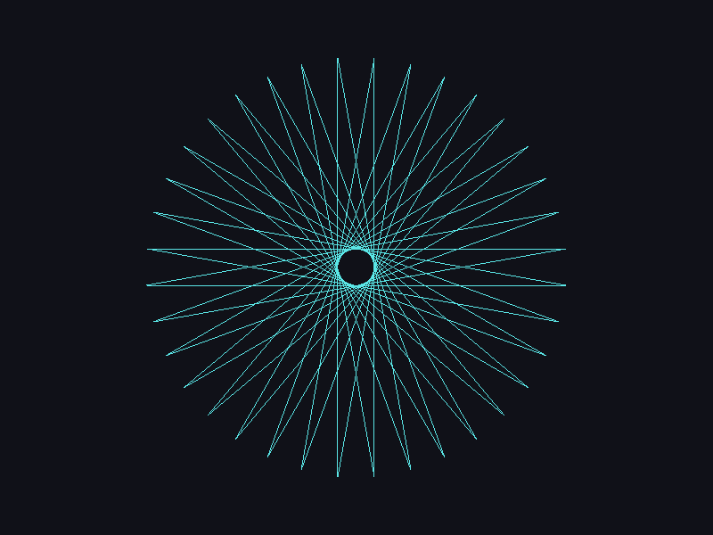
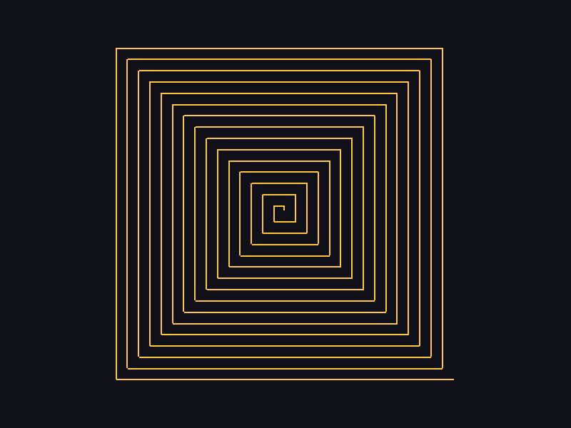
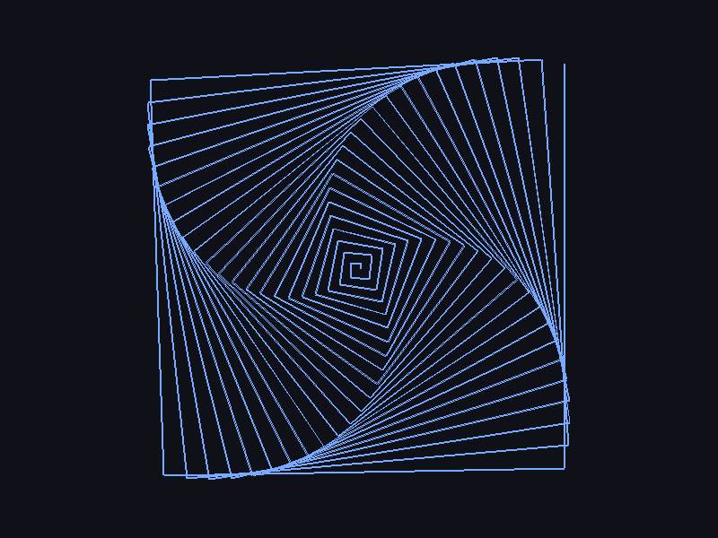
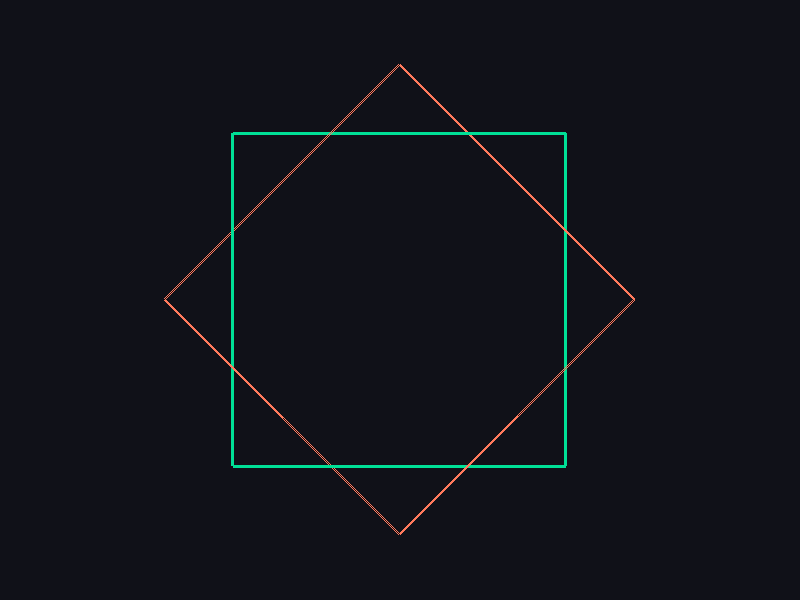
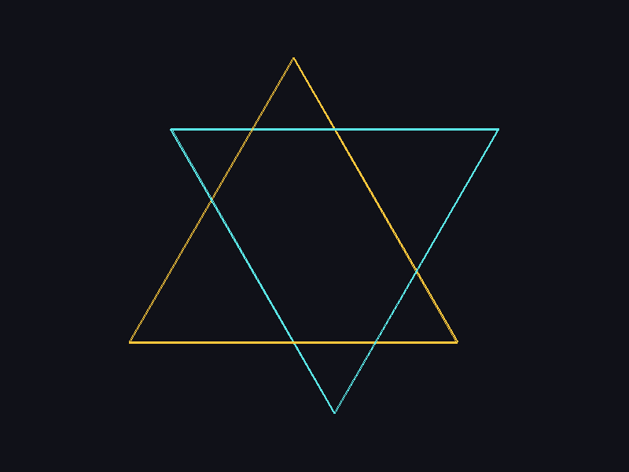
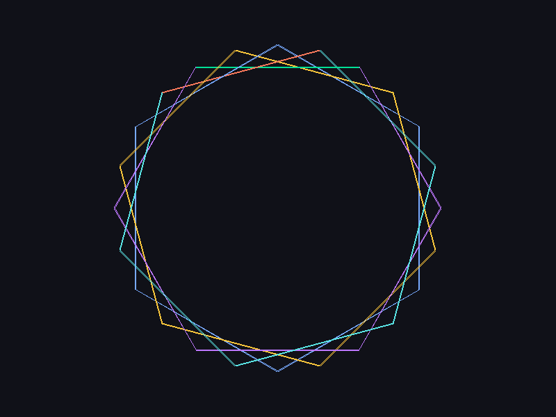
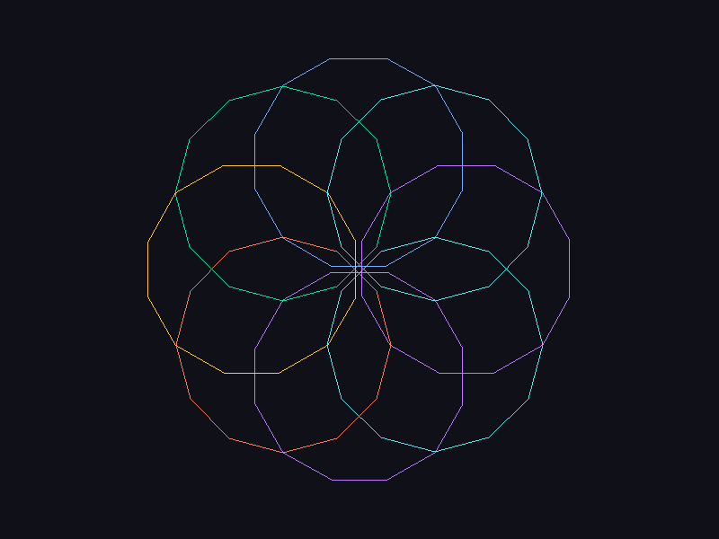
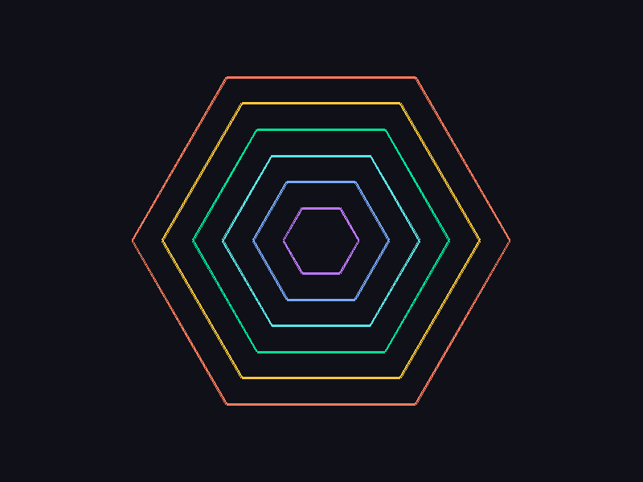

# Artworks

Compositions ready to copy and paste. Each one was rendered with this exact
code — the image beside it is the result, not an illustration.

**How to use:** open `main.flx`, delete whatever sits between
`timeline.Timeline.reset()` and the execution line, and paste the block in its
place. Save.

They all use `hide()` so the turtle does not show up in the finished drawing,
and `speed(900.0)` to draw fast — lower the speed if you want to watch calmly.
The colours are only a suggestion: change them freely.

---

## Repeating a movement

Almost every artwork here is the same movement repeated. Your scene is an
ordinary Fluxa program, so you can write the loop yourself:

```fluxa
leo.go(1, 470.0, 0.0)

int s = 2
while s <= 36 {
    leo.go(s, 470.0, 170.0)
    s = s + 1
}
```

Or hand the whole run to the turtle, which is the idiomatic form — the loop
runs inside the method, on the fast path, and the values arrive as arguments:

```fluxa
leo.go(1, 470.0, 0.0)
leo.ring(2, 35, 470.0, 170.0)
```

`ring(first, count, dist, turn)` declares `count` steps starting at `first`,
each walking `dist` pixels after turning `turn` degrees. `spiral` adds one
argument, the growth per step:

```fluxa
leo.spiral(1, 60, 12.0, 14.0, 90.0)
```

`ring_silent` is the same as `ring` without leaving a trail.

Both forms produce exactly the same timeline. Use the explicit loop when you
want to see what is happening, and the method when you want the artwork to read
in one line.

---

## Rosette



Thirty-six equal strokes, turning **170°** on each one. The angle does not divide 360, so the turtle never retraces her path — she only closes the figure after seventeen laps.

This one is written with the loop spelled out, because it is the shape of every other artwork here. Swapping 170 for 160, 175 or 144 gives completely different rosettes; it is the first parameter worth playing with.

`1 turtle` · `36 steps`

```fluxa
Block leo typeof turtle.Turtle
leo.spawn(165.0, 320.6)
leo.color(90, 230, 230)
leo.path_color(90, 230, 230)
leo.path_width(1)
leo.speed(900.0)
leo.hide()

leo.go(1, 470.0, 0.0)

int s = 2
while s <= 36 {
    leo.go(s, 470.0, 170.0)
    s = s + 1
}```

---

## Square spiral



A fixed **90°** turn and a side that grows 7 pixels per step. That is all a polygonal spiral is, and `spiral` takes exactly those numbers: first step, how many, starting length, how much it grows, and the turn.

`1 turtle` · `60 steps`

```fluxa
Block leo typeof turtle.Turtle
leo.spawn(399.4, 295.5)
leo.color(255, 200, 60)
leo.path_color(255, 200, 60)
leo.path_width(2)
leo.speed(900.0)
leo.hide()

leo.spiral(1, 60, 6.7, 7.9, 90.0)```

---

## Snail



The same spiral with **89°** instead of 90. One degree less and the square slowly rotates as it grows — the difference between a figure standing still and one that seems to turn.

`1 turtle` · `90 steps`

```fluxa
Block leo typeof turtle.Turtle
leo.spawn(403.2, 300.5)
leo.color(120, 170, 255)
leo.path_color(120, 170, 255)
leo.path_width(2)
leo.speed(900.0)
leo.hide()

leo.spiral(1, 90, 6.2, 5.0, 89.0)```

---

## Eight-pointed star



Two squares, one turned 45°. Both turtles declare the **same steps**, so they draw side by side — press R once it is done to watch.

`2 turtles` · `4 steps`

```fluxa
Block leo typeof turtle.Turtle
leo.spawn(566.2, 466.2)
leo.color(0, 224, 150)
leo.path_color(0, 224, 150)
leo.path_width(3)
leo.speed(900.0)
leo.hide()

Block ana typeof turtle.Turtle
ana.spawn(635.0, 300.0)
ana.color(255, 122, 92)
ana.path_color(255, 122, 92)
ana.path_width(3)
ana.speed(900.0)
ana.hide()
ana.face(45.0)

leo.ring(1, 4, 332.3, 90.0)
ana.ring(1, 4, 332.3, 90.0)```

---

## Hexagram



Two triangles, one turned 60°. Three steps and the six-pointed star is closed.

`2 turtles` · `3 steps`

```fluxa
Block leo typeof turtle.Turtle
leo.spawn(582.8, 435.7)
leo.color(255, 200, 60)
leo.path_color(255, 200, 60)
leo.path_width(3)
leo.speed(900.0)
leo.hide()

Block ana typeof turtle.Turtle
ana.spawn(635.0, 164.3)
ana.color(90, 230, 230)
ana.path_color(90, 230, 230)
ana.path_width(3)
ana.speed(900.0)
ana.hide()
ana.face(60.0)

leo.ring(1, 3, 417.8, 120.0)
ana.ring(1, 3, 417.8, 120.0)```

---

## Mandala



Six hexagons from the same centre, each turned 15°. Since a hexagon maps onto itself every 60°, the rotation step has to be smaller than that — otherwise the six copies land exactly on top of one another.

`6 turtles` · `6 steps`

```fluxa
Block t1 typeof turtle.Turtle
t1.spawn(517.5, 96.5)
t1.color(0, 224, 150)
t1.path_color(0, 224, 150)
t1.path_width(2)
t1.speed(900.0)
t1.hide()

Block t2 typeof turtle.Turtle
t2.spawn(460.8, 73.0)
t2.color(255, 122, 92)
t2.path_color(255, 122, 92)
t2.path_width(2)
t2.speed(900.0)
t2.hide()
t2.face(15.0)

Block t3 typeof turtle.Turtle
t3.spawn(400.0, 65.0)
t3.color(120, 170, 255)
t3.path_color(120, 170, 255)
t3.path_width(2)
t3.speed(900.0)
t3.hide()
t3.face(30.0)

Block t4 typeof turtle.Turtle
t4.spawn(339.2, 73.0)
t4.color(255, 200, 60)
t4.path_color(255, 200, 60)
t4.path_width(2)
t4.speed(900.0)
t4.hide()
t4.face(45.0)

Block t5 typeof turtle.Turtle
t5.spawn(282.5, 96.5)
t5.color(190, 120, 255)
t5.path_color(190, 120, 255)
t5.path_width(2)
t5.speed(900.0)
t5.hide()
t5.face(60.0)

Block t6 typeof turtle.Turtle
t6.spawn(233.8, 133.8)
t6.color(90, 230, 230)
t6.path_color(90, 230, 230)
t6.path_width(2)
t6.speed(900.0)
t6.hide()
t6.face(75.0)

t1.ring(1, 6, 235.0, -60.0)
t2.ring(1, 6, 235.0, -60.0)
t3.ring(1, 6, 235.0, -60.0)
t4.ring(1, 6, 235.0, -60.0)
t5.ring(1, 6, 235.0, -60.0)
t6.ring(1, 6, 235.0, -60.0)```

---

## Flower



Eight twelve-sided polygons, their centres offset from the middle and turned 45°. The classic flower of circles. It uses all eight turtles — the pool limit.

`8 turtles` · `12 steps`

```fluxa
Block p1 typeof turtle.Turtle
p1.spawn(550.4, 184.4)
p1.color(190, 120, 255)
p1.path_color(190, 120, 255)
p1.path_width(1)
p1.speed(900.0)
p1.hide()

Block p2 typeof turtle.Turtle
p2.spawn(424.6, 111.9)
p2.color(90, 230, 230)
p2.path_color(90, 230, 230)
p2.path_width(1)
p2.speed(900.0)
p2.hide()
p2.face(45.0)

Block p3 typeof turtle.Turtle
p3.spawn(284.4, 149.6)
p3.color(120, 170, 255)
p3.path_color(120, 170, 255)
p3.path_width(1)
p3.speed(900.0)
p3.hide()
p3.face(90.0)

Block p4 typeof turtle.Turtle
p4.spawn(211.9, 275.4)
p4.color(0, 224, 150)
p4.path_color(0, 224, 150)
p4.path_width(1)
p4.speed(900.0)
p4.hide()
p4.face(135.0)

Block p5 typeof turtle.Turtle
p5.spawn(249.6, 415.6)
p5.color(255, 200, 60)
p5.path_color(255, 200, 60)
p5.path_width(1)
p5.speed(900.0)
p5.hide()
p5.face(180.0)

Block p6 typeof turtle.Turtle
p6.spawn(375.4, 488.1)
p6.color(255, 122, 92)
p6.path_color(255, 122, 92)
p6.path_width(1)
p6.speed(900.0)
p6.hide()
p6.face(225.0)

Block p7 typeof turtle.Turtle
p7.spawn(515.6, 450.4)
p7.color(190, 120, 255)
p7.path_color(190, 120, 255)
p7.path_width(1)
p7.speed(900.0)
p7.hide()
p7.face(270.0)

Block p8 typeof turtle.Turtle
p8.spawn(588.1, 324.6)
p8.color(90, 230, 230)
p8.path_color(90, 230, 230)
p8.path_width(1)
p8.speed(900.0)
p8.hide()
p8.face(315.0)

p1.ring(1, 12, 61.9, -30.0)
p2.ring(1, 12, 61.9, -30.0)
p3.ring(1, 12, 61.9, -30.0)
p4.ring(1, 12, 61.9, -30.0)
p5.ring(1, 12, 61.9, -30.0)
p6.ring(1, 12, 61.9, -30.0)
p7.ring(1, 12, 61.9, -30.0)
p8.ring(1, 12, 61.9, -30.0)```

---

## Target



Six concentric hexagons of growing size, one per turtle, all on the same steps. They grow together, from the centre outwards.

`6 turtles` · `6 steps`

```fluxa
Block h1 typeof turtle.Turtle
h1.spawn(423.5, 259.3)
h1.color(190, 120, 255)
h1.path_color(190, 120, 255)
h1.path_width(3)
h1.speed(900.0)
h1.hide()

Block h2 typeof turtle.Turtle
h2.spawn(442.3, 226.7)
h2.color(120, 170, 255)
h2.path_color(120, 170, 255)
h2.path_width(3)
h2.speed(900.0)
h2.hide()

Block h3 typeof turtle.Turtle
h3.spawn(461.1, 194.2)
h3.color(90, 230, 230)
h3.path_color(90, 230, 230)
h3.path_width(3)
h3.speed(900.0)
h3.hide()

Block h4 typeof turtle.Turtle
h4.spawn(479.9, 161.6)
h4.color(0, 224, 150)
h4.path_color(0, 224, 150)
h4.path_width(3)
h4.speed(900.0)
h4.hide()

Block h5 typeof turtle.Turtle
h5.spawn(498.7, 129.0)
h5.color(255, 200, 60)
h5.path_color(255, 200, 60)
h5.path_width(3)
h5.speed(900.0)
h5.hide()

Block h6 typeof turtle.Turtle
h6.spawn(517.5, 96.5)
h6.color(255, 122, 92)
h6.path_color(255, 122, 92)
h6.path_width(3)
h6.speed(900.0)
h6.hide()

h1.ring(1, 6, 47.0, -60.0)
h2.ring(1, 6, 84.6, -60.0)
h3.ring(1, 6, 122.2, -60.0)
h4.ring(1, 6, 159.8, -60.0)
h5.ring(1, 6, 197.4, -60.0)
h6.ring(1, 6, 235.0, -60.0)```

---

## Making your own

Three things explain almost every turtle artwork:

**The angle that does not close.** If the turn divides 360 (90, 60, 120), the
figure closes and stops. If it does not (170, 89, 121), the turtle keeps turning
and drawing over itself — that is where rosettes come from.

**The side that grows.** A constant distance gives a polygon; a distance that
increases each step gives a spiral. That is `ring` against `spiral`.

**The same artwork several times, rotated.** Put the turtles on the same steps,
each with a different `face()`. Mind the figure's own symmetry: turning a
hexagon by 60° gives back the same hexagon, so the rotation step has to be
smaller than its symmetry.

A loop can declare steps, but it cannot declare turtles — `Block ... typeof` is
a declaration, not a statement you repeat. Eight turtles, eight lines. And that
is the limit: past it the tool warns in the terminal and ignores the extra ones.
