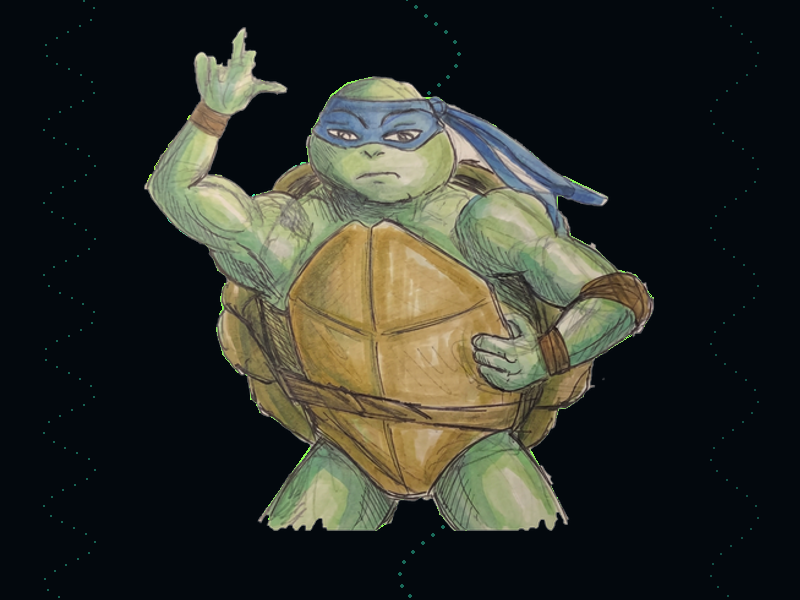
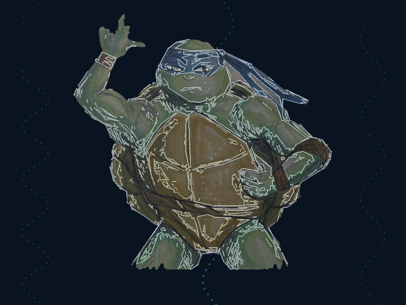

# Leonardo

*A drawing made by hand, drawn back by turtles — and then it says goodbye.*



**[Watch it](leonardo.mp4)** — 3433 frames at 90 fps, 38 seconds, written by the
program itself with one line: `export.Video(1, 0, 90)`.

**[Run it](leonardo.flx)** — `./fluxa run docs/artworks/leonardo.flx`.

Six turtles draw a pencil drawing back, line by line. The forearm waves three
times. Then the photograph the line art was traced from lands on top of it —
exactly on top, to the pixel — and the piece is over.

Ten turtles, 1042 steps, 317 outlines, neon on near-black. Nothing in it was
placed by eye.

---

## Where it comes from

A drawing on paper. Photographed, painted over, and handed to the tool, which
had never been given anything that did not start as code.

That is the point of the piece. Everything else in this repository is a figure
somebody typed — a rosette, a star, a turtle drawn out of arcs. This one starts
somewhere the tool cannot reach: graphite on a sheet, with a wobble in every
line and a thumb that the paint did not quite finish. The tracer's whole job is
to get that into steps without smoothing the hand out of it, and the ending
exists to prove it did: the photograph comes back and sits on its own outlines.

---

## How it goes

| Steps | What happens |
|---|---|
| 1 – 379 | six turtles draw the line art, three columns of bubbles rise behind it |
| 380 – 775 | the forearm waves, three times |
| 837 – 1042 | the photograph lands on the line art, and holds |

Each turtle draws in its own green, so the figure comes up in bands of colour as
the six of them work, and the forearm gets the brightest one — it is the part
that moves afterwards.

**Two things to know before changing the frame rate**, both learned the hard
way here.

A step that only pivots renders exactly **one frame whatever the rate** —
nothing moves in it, so there is no duration to divide — while a step that walks
renders as many frames as its seconds are worth. So raising the frame rate makes
the drawing smoother and makes the wave *shorter*, unless the wave is given more
steps. That is why the build script holds the frame rate itself and measures the
wave in **seconds**: `WAVE_STEPS = int(FPS * 4.4)`. The only number to change is
`FPS`, and the `export.Video(1, 0, 90)` line that has to match it.

And **speed is not smoothness**. How long the drawing takes is the sum of every
segment and every jump divided by the turtles' speed, and the frame rate has
nothing to do with it. Halving the speed to "get more frames" simply makes the
video twice as long — it was tried. 317 outlines also means 317 pen-up jumps,
and those cost time too, which is why `SPEED` here is 2800 and not the 900 a
drawing of a few strokes would want.

---

## Making it

Two tools and a build script. The drawing itself is not in this repository —
what is published is the artwork, not somebody's sketchbook.

```bash
# the paper comes out, twice from the same mask: one full size to trace,
# one at 420 px to be worn as a sprite
python3 tools/cutout.py drawing.png -o cut.png    --shrink 3 --feather 1.2
python3 tools/cutout.py drawing.png -o sprite.png --shrink 3 --feather 1.2 --width 420

# the outlines become turtle code, the forearm on a turtle of its own
python3 art/build_leo.py > leo.flx
```

`cutout.py` decides what is drawing by two tests together, because the paper is
pale and grey and neither test alone finds a drawing: everything the pencil or
the paint touched is either **coloured** or **darker** than the sheet. The ink
lines are grey; the painted areas are pale. `--shrink 3` pulls the edge in by
three pixels, which is what kills the rim of paper that reads as a halo once a
sprite is over a dark stage.

The two cut-outs come from the same mask and therefore the same crop, which
matters more than it sounds. It is what makes the ending exact.

Everything after that is [`trace.py`](../TRACE.md) — 317 outlines, simplified
until the drawing fits a budget of 460 steps, spread over six turtles that draw
in parallel.

---

## The three things that had to be got right

### The forearm, not the arm

`pivot` turns everything **one turtle** has drawn, so the part that waves has to
have been drawn by its own turtle. But a traced outline runs from the fingertips
all the way down to the hip — sorting outlines whole puts the hip on the
forearm. So they are **cut**, per point, where the forearm meets the upper arm.

The cut is a **capsule** around the axis that runs from the elbow through the
wrist and on to the fingertips: along the axis from just below the elbow to the
end of the hand, and no further than 55 px from it sideways.

```python
UP   = normalise(WRIST - ELBOW)        # elbow (168,196) -> wrist (205,115)
SIDE = (-UP.y, UP.x)
along = dot(p - ELBOW, UP)
inside = -8 < along < 195 and abs(dot(p - ELBOW, SIDE)) < 55
```

It took two wrong answers to get there. The first swung the **whole arm from the
shoulder**, which is a different gesture — that is not how anybody waves. The
second cut at the elbow crease with a half-plane, and the shoulder went along
with it: the forearm points up and to the right, so the shoulder's projection
onto that axis is positive too. **The sideways limit is what tells an arm from
the body it is attached to.**

The elbow and the wrist were read off the painting with a grid over it, in stage
coordinates.

### The wave has to come home

`pivot(step, deg, cx, cy)` takes the angle the drawing should be **at**, not a
turn to add. So a sine of the step sweeps the forearm out and back and lands it
exactly where it started:

```fluxa
int wave = 0
while wave <= 396 {
    float ph = math.to_float(wave) / 396.0
    float ang = 15.0 * math.sin(ph * 18.84956)
    arm.pivot(379 + 1 + wave, ang, 168, 196)
    wave = wave + 1
}
```

Three cycles, fifteen degrees each way. If the angle accumulated instead of
being absolute, the arm would drift a little every cycle and the last frame
would not fit the photograph — which is the next problem.

### The photograph fits because it is the same arithmetic

The trace is fitted to the stage with one scale and one offset. The sprite is
the same cut-out, so the same two numbers say where it goes and how big it is:

```
k      = 0.2869                                     the fit
centre = (cut_w/2, cut_h/2) * k + offset  = (399.1, 278.7)
scale  = k * cut_w / sprite_w             = 1.2260
```

```fluxa
Block real typeof turtle.Turtle
real.spawn(0.0 - 400.0, 278.7)
real.image("sprite.png", 1.2260)
real.hide()
real.jump(836, 399.1, 278.7)     // into place, invisible, arriving from the left
real.show()
```

Measured on the render, the painting lands at (145, 29)–(649, 530) against the
(142, 25)–(657, 533) the arithmetic predicts — the difference is the transparent
margin of the sprite. Blending the two frames shows the traced outlines sitting
on the painted edges they came from:



She arrives **hidden and from the left**, because a sprite is turned by its
turtle's heading and a jump leaves her facing the way she travelled. Coming in
from the left leaves her upright. Then `show()`, and a run of zero-length jumps
holds the final frame.

---

## What it uses

`jump` · `toward` · `pivot` · `image` · `show`/`hide` · `path_dots` ·
`path_opacity` · `export.Video`, and from the tools,
[`cutout.py` and `trace.py`](../TRACE.md).

It also found a real bug: the two-pass rebuild that draws layered strokes did
not re-apply erases before its second pass, so an erased sketch came back from
the dead. An artwork is a test with an audience.

---

# The complete code

Two files, and the first one writes the second.

## The artwork — [leonardo.flx](leonardo.flx)

1944 lines, because 317 outlines are 1345 `toward` calls. It is ordinary turtle
code and it runs on its own:

```bash
./fluxa run docs/artworks/leonardo.flx
```

It opens like any artwork in this repository, and everything after this is
generated:

```fluxa
import std graph
import std image
import std math
import std strings
import std time
import std fs
import std video
import static config
import static stage
import static pool
import static timeline
import static painter
import static turtle
import static export
import static panel
import static runner

prst dyn win    = graph.init(800, 600, "Leonardo")
prst dyn canvas = image.new(800, 600)
prst int done   = 0
prst dyn part   = [0.0, 0.0]

graph.set_fps(win, 60)
stage.Stage.background(3, 8, 13)
pool.Pool.reset()
timeline.Timeline.reset()

Block t0 typeof turtle.Turtle
t0.spawn(372.3, 78.0)
```

...then six turtles' worth of `jump`/`toward`, the bubbles, the wave, and the
reveal. The sprite it lands at the end is
[leonardo-sprite.png](leonardo-sprite.png), the cut-out the line art was traced
from.

## The build script — `art/build_leo.py`

This is the part worth reading: it traces the drawing, cuts the forearm out of
it, works out where the photograph goes, and prints the artwork.

```python
#!/usr/bin/env python3
"""build_leo.py — a hand drawing, drawn by turtles, waving goodbye.

    python3 art/build_leo.py > art/leo_wave.flx

Three things have to line up, and all three come out of this file:

1. **The line art.** The cut-out is traced here rather than read from a
   finished .flx, because the tracer's own coordinates are what makes the last
   trick possible.

2. **The arm on a turtle of its own.** `pivot` turns everything ONE turtle has
   drawn, so the arm that waves has to have been drawn by an arm turtle. The
   outlines run from the fingertips down to the hip, so they are CUT at the
   boundary of the arm's box rather than sorted whole.

3. **The photograph landing exactly on the line art.** Both come from the same
   cut-out, so the transform that put the trace on the stage — one scale and one
   offset — also says where the picture goes and how big it is. No eyeballing:
   `sprite scale = k * cut_width / sprite_width`, and the centre of the cut-out
   maps to the centre of the drawing.
"""

import sys
sys.path.insert(0, "tools")
import trace as T
from PIL import Image

CUT    = "art/tartaruga_cut.png"      # full size, traced
SPRITE = "art/tartaruga_sprite.png"   # the same cut-out at 420 px, worn as a sprite
W, H, MARGIN = 800, 600, 70
BUDGET = 460                         # steps the drawing may cost

THRESHOLD, BLUR = 130, 2.0

# What waves is the FOREARM, from the elbow up — a wave that swings the whole
# arm from the shoulder is a different gesture. Read off the painting, in stage
# coordinates: the elbow is the bend at the bottom left of the raised arm, and
# the forearm runs from it up to the wrist.
ELBOW = (168.0, 196.0)
WRIST = (205.0, 115.0)

# What gets cut out is a CAPSULE around the axis from the elbow through the
# wrist and on to the fingertips: along the axis from just below the elbow to
# the end of the hand, and no further than REACH from it sideways.
#
# A half-plane through the elbow is not enough and was the first attempt: the
# forearm points up and to the right, so the projection of the SHOULDER onto
# that axis is positive too, and the shoulder swung with the wave. The sideways
# limit is what tells an arm from the body it is attached to.
AXIS_FROM, AXIS_TO = -8.0, 195.0
REACH = 55.0

PIVOT_X, PIVOT_Y = int(ELBOW[0]), int(ELBOW[1])

# The frame rate lives HERE, once, because two things depend on it and one
# does not, and mixing them up costs a whole render.
#
#   * A step that only pivots renders exactly ONE frame at any frame rate:
#     nothing moves in it, so there is no duration to divide. The wave and the
#     holds are therefore measured in SECONDS here and turned into steps.
#   * A step that walks renders as many frames as its seconds are worth, so the
#     drawing's smoothness follows the frame rate for free.
#   * SPEED does not. It sets how LONG the drawing takes; halving it does not
#     buy frames, it buys running time.
FPS = 90

WAVE_SWEEP, WAVES = 15.0, 3
WAVE_SECONDS = 4.4
WAVE_STEPS = int(FPS * WAVE_SECONDS)
HOLD_BEFORE = int(FPS * 0.7)          # a breath before the photograph lands
HOLD_AFTER  = int(FPS * 2.3)          # and how long it stays
# How long the drawing takes is the sum of every segment and every jump
# divided by this — it has nothing to do with the frame rate. Halving it does
# not make the video smoother, it makes the video twice as long; the frame rate
# is what smoothness comes from. 317 outlines means 317 pen-up jumps, and they
# cost time too, which is why this is higher than it looks.
SPEED = 2800.0

# Neon, and not one neon: each turtle draws in its own green, so the drawing
# comes up in bands of colour as the six of them work. The forearm gets the
# brightest one, because it is the part that moves afterwards.
INKS = [(140, 255, 80), (80, 255, 130), (60, 255, 180),
        (115, 255, 95), (70, 245, 150)]
ARM_INK = (170, 255, 60)


_dx, _dy = WRIST[0] - ELBOW[0], WRIST[1] - ELBOW[1]
_len = (_dx * _dx + _dy * _dy) ** 0.5
UP   = (_dx / _len, _dy / _len)        # along the forearm, elbow -> wrist
SIDE = (-UP[1], UP[0])                 # square to it


def inside(p):
    dx, dy = p[0] - ELBOW[0], p[1] - ELBOW[1]
    along = dx * UP[0] + dy * UP[1]
    if along < AXIS_FROM or along > AXIS_TO:
        return False
    return abs(dx * SIDE[0] + dy * SIDE[1]) < REACH


def cut_at_boundary(sub):
    """One outline into the runs that are arm and the runs that are not."""
    runs, cur, was = [], [], None
    for p in sub.pts:
        now = inside(p)
        if was is None or now == was:
            cur.append(p)
        else:
            cur.append(p)          # the crossing point belongs to both
            runs.append((was, cur))
            cur = [p]
        was = now
    if len(cur) > 1:
        runs.append((was, cur))
    return [(w, T.Sub(pts, None, False)) for w, pts in runs if len(pts) > 1]


def main():
    subs = T.read_raster(CUT, THRESHOLD, False, BLUR)
    subs = [s for s in subs if len(s.pts) > 1]

    # The fit, done here instead of by T.fit, because the numbers ARE the trick:
    # k and the offsets are what place the photograph over the drawing later.
    xs = [p[0] for s in subs for p in s.pts]
    ys = [p[1] for s in subs for p in s.pts]
    x0, x1, y0, y1 = min(xs), max(xs), min(ys), max(ys)
    k = min((W - 2 * MARGIN) / (x1 - x0), (H - 2 * MARGIN) / (y1 - y0))
    ox = (W - (x1 - x0) * k) / 2 - x0 * k
    oy = (H - (y1 - y0) * k) / 2 - y0 * k
    for s in subs:
        s.pts = [(p[0] * k + ox, p[1] * k + oy) for p in s.pts]

    tol = 0.0
    kept = T.simplify(subs, tol, 3)
    while T.total_steps(T.split(kept, 6)) > BUDGET and tol < 64:
        tol = 0.4 if tol == 0 else tol * 1.6
        kept = T.simplify(subs, tol, 3)

    arm, body = [], []
    for sb in kept:
        for is_arm, piece in cut_at_boundary(sb):
            (arm if is_arm else body).append(piece)

    out = []

    def turtle(name, pieces, ink):
        first = pieces[0].pts[0]
        out.append(f"Block {name} typeof turtle.Turtle")
        out.append(f"{name}.spawn({first[0]:.1f}, {first[1]:.1f})")
        out.append(f"{name}.hide()")
        out.append(f"{name}.speed({SPEED})")
        out.append(f"{name}.path_width(2)")
        out.append(f"{name}.path_color({ink[0]}, {ink[1]}, {ink[2]})")
        step = 1
        for sb in pieces:
            out.append(f"{name}.jump({step}, {sb.pts[0][0]:.1f}, {sb.pts[0][1]:.1f})")
            step += 1
            for p in sb.pts[1:]:
                out.append(f"{name}.toward({step}, {p[0]:.1f}, {p[1]:.1f})")
                step += 1
        out.append("")
        return step - 1

    drawn = 0
    for i, g in enumerate(T.split(body, 5)):
        drawn = max(drawn, turtle(f"t{i}", g, INKS[i % len(INKS)]))
    drawn = max(drawn, turtle("arm", arm, ARM_INK))

    # ── the water, for as long as the drawing takes ────────────────
    out.append("// ── the water ─────────────────────────────────────────────────────")
    out.append("//")
    out.append("// Three columns of bubbles, rising for exactly as long as the drawing")
    out.append("// takes. Dots, not lines, and a sine of the step for the wobble.")
    out.append("")
    cols = [(70.0, 1.55, 26.0, 0.09, 0.0, 3, 55), (430.0, 1.80, 30.0, 0.05, 2.0, 4, 60),
            (735.0, 1.66, 24.0, 0.07, 1.0, 3, 45)]
    for i, (bx, rise, amp, freq, phase, wdt, opa) in enumerate(cols):
        out.append(f"Block b{i} typeof turtle.Turtle")
        out.append(f"b{i}.spawn({bx:.1f}, 640.0)")
        out.append(f"b{i}.hide()")
        out.append(f"b{i}.speed(80.0)")
        out.append(f"b{i}.path_color(40, 170, 140)")
        out.append(f"b{i}.path_width({wdt})")
        out.append(f"b{i}.path_dots()")
        out.append(f"b{i}.path_opacity({opa})")
        out.append("")

    total_wave = drawn + WAVE_STEPS
    out.append("int u = 0")
    out.append(f"while u <= {total_wave} {{")
    out.append("    float fu = math.to_float(u)")
    for i, (bx, rise, amp, freq, phase, wdt, opa) in enumerate(cols):
        # Each column crosses the stage exactly once. A rate that wraps would
        # draw one long streak from the top back to the floor: `toward` goes
        # straight to wherever it is told, and it is holding a pen.
        rate = (700.0 + i * 60.0) / total_wave
        out.append(f"    b{i}.toward(1 + u, {bx:.1f} + {amp:.1f} * math.sin(fu * {freq:.3f} + {phase:.1f}), "
                   f"640.0 - fu * {rate:.4f})")
    out.append("    u = u + 1")
    out.append("}")
    out.append("")

    # ── the wave ───────────────────────────────────────────────────
    out.append("// ── and then it waves ─────────────────────────────────────────────")
    out.append("//")
    out.append("// `pivot` turns everything the forearm turtle has drawn about the elbow,")
    out.append("// and the angle is absolute — so a sine of the step sweeps it out and")
    out.append("// back and lands it exactly where it started, which is what lets the")
    out.append("// photograph fit afterwards.")
    out.append("")
    out.append("int wave = 0")
    out.append(f"while wave <= {WAVE_STEPS} {{")
    out.append(f"    float ph = math.to_float(wave) / {float(WAVE_STEPS)}")
    out.append(f"    float ang = {WAVE_SWEEP} * math.sin(ph * {2 * 3.14159265 * WAVES:.5f})")
    out.append(f"    arm.pivot({drawn} + 1 + wave, ang, {PIVOT_X}, {PIVOT_Y})")
    out.append("    wave = wave + 1")
    out.append("}")
    out.append("")

    # ── the reveal ─────────────────────────────────────────────────
    cw, ch = Image.open(CUT).size
    sw, _ = Image.open(SPRITE).size
    scale = k * cw / sw
    cx = (cw / 2.0) * k + ox
    cy = (ch / 2.0) * k + oy

    show_at = total_wave + HOLD_BEFORE
    out.append("// ── and it was a drawing all along ────────────────────────────────")
    out.append("//")
    out.append("// The photograph the line art was traced from, landing on top of it.")
    out.append("// Not placed by eye: the trace was fitted to the stage with one scale")
    out.append(f"// and one offset (k = {k:.4f}), and the same numbers say where the")
    out.append(f"// picture goes ({cx:.1f},{cy:.1f}) and how big it is ({scale:.4f} of a")
    out.append(f"// {sw} px sprite that stands for {cw} px of cut-out).")
    out.append("//")
    out.append("// She arrives hidden — a jump leaves her facing along it, and coming in")
    out.append("// from the left leaves her upright, which is how a sprite has to land.")
    out.append("")
    out.append("Block real typeof turtle.Turtle")
    out.append(f"real.spawn(0.0 - 400.0, {cy:.1f})")
    out.append(f'real.image("{SPRITE}", {scale:.4f})')
    out.append("real.hide()")
    out.append("real.speed(6000.0)")
    out.append("real.path_off()")
    out.append(f"real.jump({show_at - 1}, {cx:.1f}, {cy:.1f})")
    out.append("real.show()")
    out.append("int hold = 0")
    out.append(f"while hold < {HOLD_AFTER} {{")
    out.append(f"    real.jump({show_at} + hold, {cx:.1f}, {cy:.1f})")
    out.append("    hold = hold + 1")
    out.append("}")
    out.append("")

    print("\n".join(out))
    say = lambda m: print(m, file=sys.stderr)
    say(f"drawing   1..{drawn}       ({len(kept)} outlines, {len(arm)} arm pieces, tol {tol:.2f})")
    say(f"wave      {drawn + 1}..{total_wave}")
    say(f"reveal    {show_at}..{show_at + HOLD_AFTER - 1}")
    say(f"placement k={k:.4f}  centre=({cx:.1f},{cy:.1f})  sprite scale={scale:.4f}")
    say(f"export    export.Video(1, 0, {FPS})   <- must match FPS in this file")


if __name__ == "__main__":
    main()
```
